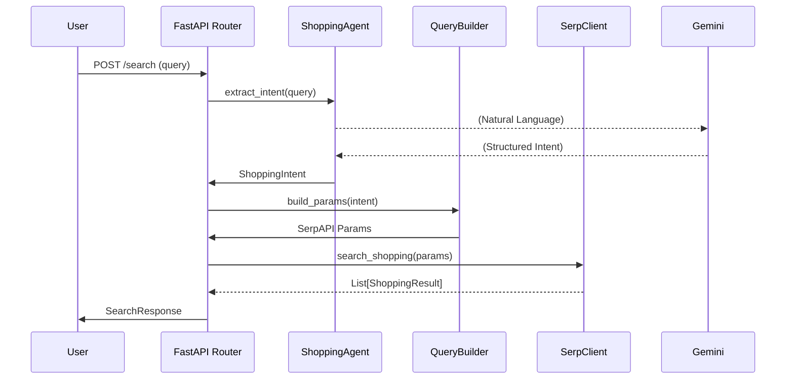

# Shopping Query Agent Documentation

The **Shopping Query Agent** is an AI-powered FastAPI application designed to transform natural language shopping queries into structured search results. It leverages the **Google ADK (Agent Development Kit)** with **Gemini 1.5 Flash** for intent extraction and **SerpAPI** for real-time Google Shopping data.

## Table of Contents
- [Architecture Overview](#architecture-overview)
- [Key Components](#key-components)
  - [ShoppingAgent](#shoppingagent)
  - [QueryBuilder](#querybuilder)
  - [SerpClient](#serpclient)
- [Data Models](#data-models)
- [API Endpoints](#api-endpoints)
- [Configuration](#configuration)
- [Workflow Diagram](#workflow-diagram)

---

## Architecture Overview

The project follows a modular FastAPI structure:
- **`app/main.py`**: Entry point, initializes the FastAPI app and includes routers.
- **`app/agents/`**: Contains AI logic for query understanding.
- **`app/services/`**: Handles external integrations (SerpAPI) and query transformation.
- **`app/models/`**: Defines Pydantic schemas for requests and responses.
- **`app/routers/`**: Defines API endpoints.

---

## Key Components

### ShoppingAgent
Located in [`app/agents/shopping_agent.py`](file:///d:/Virasaa/Project_1/shopping-query-agent/app/agents/shopping_agent.py), this component is responsible for understanding user intent.
- **Technology**: Google ADK, Gemini 1.5 Flash.
- **Functionality**: Extracts structured fields like `product_type`, `brand`, `price_min`, `price_max`, `color`, and `size` from a raw string.
- **Mechanism**: Uses `InMemorySessionService` and a `Runner` to execute the agent asynchronously.

### QueryBuilder
Located in [`app/services/query_builder.py`](file:///d:/Virasaa/Project_1/shopping-query-agent/app/services/query_builder.py).
- **Functionality**: Takes the structured `ShoppingIntent` and converts it into a dictionary of parameters compatible with SerpAPI's Google Shopping engine.
- **Logic**: Combines attributes into a query string `q` and maps price filters to the `tbs` parameter (e.g., `ppr_min`, `ppr_max`).

### SerpClient
Located in [`app/services/serp_client.py`](file:///d:/Virasaa/Project_1/shopping-query-agent/app/services/serp_client.py).
- **Functionality**: Executes asynchronous HTTP requests to SerpAPI.
- **Mocking**: Includes a fallback `_get_mock_response()` method to allow development and testing without an active SerpAPI key.

---

## Data Models

The project uses Pydantic models for strict type checking and validation:

| Model | Description |
| :--- | :--- |
| **`SearchRequest`** | Contains the raw `query` string from the user. |
| **`ShoppingIntent`** | Structured intent (product, brand, price range, etc.) with `extra='forbid'` for Gemini compatibility. |
| **`ShoppingResult`** | Normalized product details: title, price, link, thumbnail, and source. |
| **`SearchResponse`** | A list of `ShoppingResult` objects. |

---

## API Endpoints

### 1. `POST /api/v1/search`
Main endpoint for shopping searches.
- **Payload**: `{ "query": "string" }`
- **Logic**: Intent Extraction -> Query Building -> SerpAPI Search -> Response Normalization.

### 2. `GET /health`
Simple health check to verify API status.
- **Response**: `{ "status": "ok" }`

---

## Configuration

Settings are managed via Pydantic Settings in `app/config.py` and loaded from a `.env` file.

| Variable | Description | Default |
| :--- | :--- | :--- |
| `SERP_API_KEY` | API key for SerpAPI (Google Shopping). | `dummy_serp_key` |
| `GOOGLE_API_KEY`| API key for Gemini/Google ADK. | `dummy_google_key` |

---

## Workflow Diagram

> [!NOTE]
> The `context` folder serves as a centralized knowledge base for this repository, housing coding standards, generation approaches, and project documentation (like this file).
